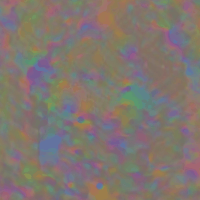
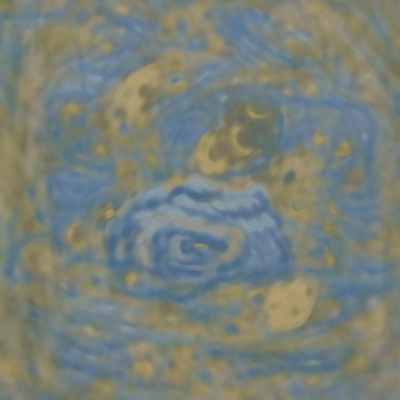
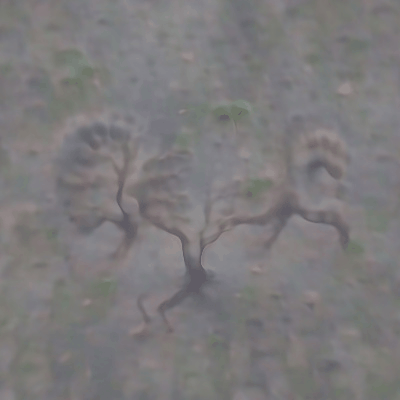
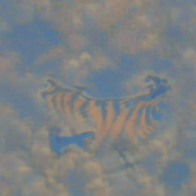
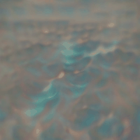
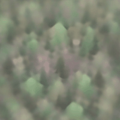
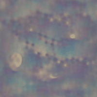

# ShallowDaze

## 介绍
ShallowDaze是可以从文本生成图像的脚本。建立在deep-daze的基础上,更改了其网络参数，目前尝试添加一些用于生成图片的网络模型，并删除了一些内容。 安装环境后，默认情况下它可以在视频内存少于4GB的图形卡上运行。 如果您想了解有关深度发呆的更多详细信息，
 请到原项目[deep-daze](https://github.com/lucidrains/deep-daze) 中查看。 这个作者简直了！！

## 例子

*五彩斑斓的黑*



*梵高的原作星空*



*浩瀚的海洋，如云的山脉，夕阳染红了天空*


*一颗用脚跑步的树*



*有翅膀的老虎飞翔在天空上*



*海洋*



*森林*



*夜空布满了星星，月亮挂在上面*



## 如何使用?

在运行脚本前，先配置好环境
```
git clone https://github.com/ecstayalive/ShallowDaze
cd ShallowDaze
python main.py
```

## 引文

```bibtex
@misc{unpublished2021clip,
    title  = {CLIP: Connecting Text and Images},
    author = {Alec Radford, Ilya Sutskever, Jong Wook Kim, Gretchen Krueger, Sandhini Agarwal},
    year   = {2021}
}
```

```bibtex
@misc{sitzmann2020implicit,
    title   = {Implicit Neural Representations with Periodic Activation Functions},
    author  = {Vincent Sitzmann and Julien N. P. Martel and Alexander W. Bergman and David B. Lindell and Gordon Wetzstein},
    year    = {2020},
    eprint  = {2006.09661},
    archivePrefix = {arXiv},
    primaryClass = {cs.CV}
}
```