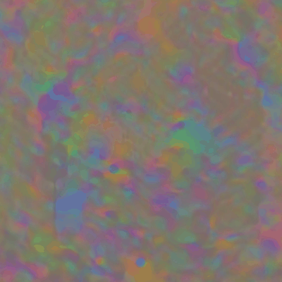
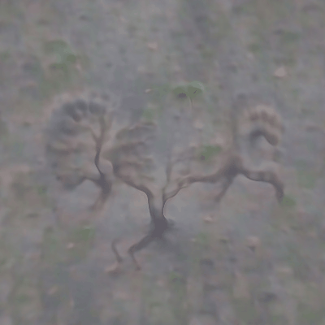
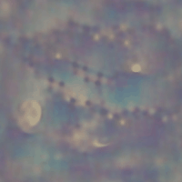

# ShallowDaze

## Introducing
ShallowDaze is a script which can generation image from text. Based on deep-daze, shallow-daze changed its network parameters and tried to add some network models for generating pictures, and deleted some content. After installing the environment, it can run on a graphics card with less than 4GB of video memory by default. If you want to know more details about deep-daze, please go to the [deep-daze](https://github.com/lucidrains/deep-daze) to have a look. By the way, the author is awesome!!

## Samples

*colorful black*



*Van Gogh's original The Starry Night*


*The vast ocean, the mountains into the clouds, the sunset stained the sky*


*A running tree with its feet*



*A tiger with wings is flying on the blue sky*


*ocean*


*forest*


*The night sky is full of stars, and the moon is hang on there*



## How to use?

Before you run the script, please install the environment.
```
git clone https://github.com/ecstayalive/ShallowDaze
cd ShallowDaze
python main.py
```

## Citations

```bibtex
@misc{unpublished2021clip,
    title  = {CLIP: Connecting Text and Images},
    author = {Alec Radford, Ilya Sutskever, Jong Wook Kim, Gretchen Krueger, Sandhini Agarwal},
    year   = {2021}
}
```

```bibtex
@misc{sitzmann2020implicit,
    title   = {Implicit Neural Representations with Periodic Activation Functions},
    author  = {Vincent Sitzmann and Julien N. P. Martel and Alexander W. Bergman and David B. Lindell and Gordon Wetzstein},
    year    = {2020},
    eprint  = {2006.09661},
    archivePrefix = {arXiv},
    primaryClass = {cs.CV}
}
```